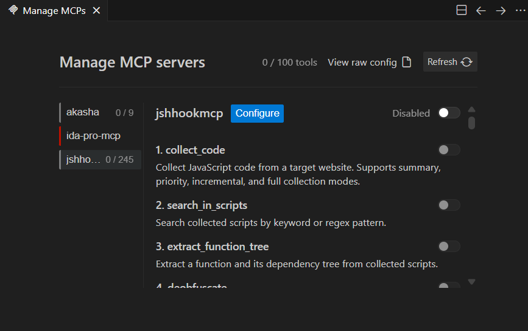
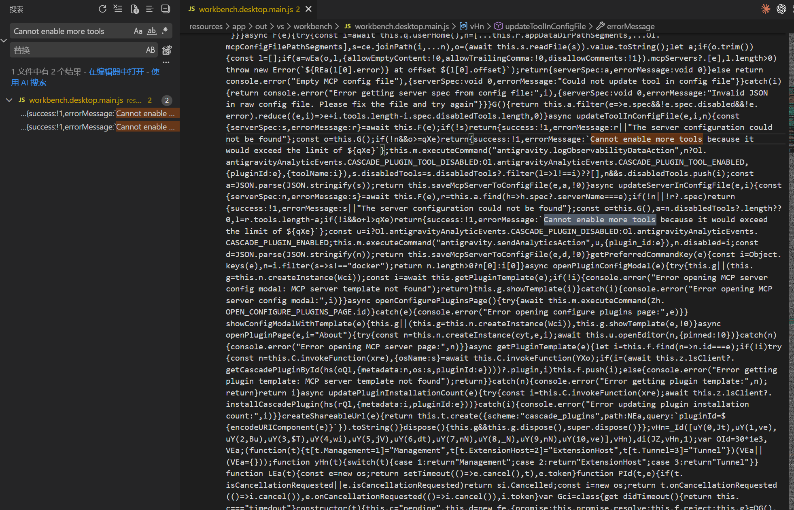
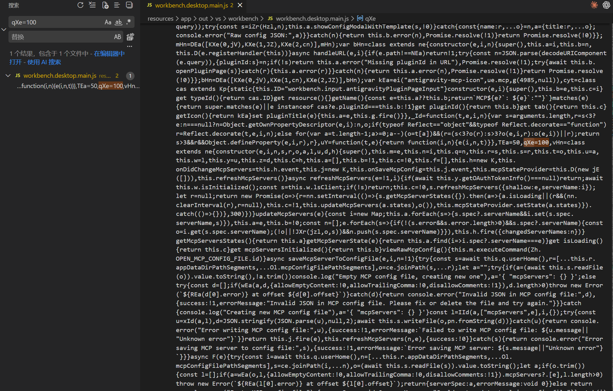
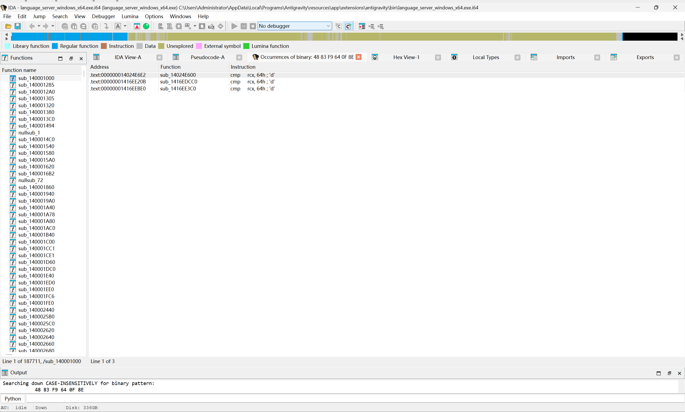

# 从一条报错到两处修补：逆向 Antigravity IDE 的 MCP 工具数量限制

## 起因

因为反重力IDE限制MCP工具数量100个，所以我在使用 [jshookmcp](https://github.com/vmoranv/jshookmcp) 的时候，被迫开启search模式，效果很差。所以我准备开启full模式。



我手动启用后直接弹出错误：

```

Error: Cannot enable more tools because it would exceed the limit of 100.

```
反正反重力是按次计算额度的，要不试试塞满会怎么样？直接开逆！

## 第一条线索：在前端 JS 中定位限制值

### 从报错文本入手

反重力基于VSCode，VSCode是基于Electron的，所以前端 UI 层本质上是打包后的 Web 应用。报错信息 `Cannot enable more tools because it would exceed the limit of 100` 大概率直接存在于前端代码中。

直接搜索 `Cannot enable more tools `，在 `resources/app/out/vs/workbench/workbench.desktop.main.js` 这个文件里找到报错文本：



能直接命中。定位到这段报错文本后，观察它所在的代码上下文，找到一个变量赋值：



```javascript
xx=50,yy=100,zz=class ...
```

其中 `xx`、`yy`、`zz` 是混淆后的短变量名。这里的 `yy=100` 就是工具数量上限的定义。修改这个赋值语句就能解除前端的限制。

这么简单出来了？我直接把 `yy=100` 改成 `yy=114514`，保存文件。但事情没有这么简单，重新打开 IDE 后，它检测到 JS 文件被篡改，然后左下角报错IDE损坏，但是关掉后没影响其他功能。因为 `product.json` 中记录了该文件的校验值。所以修补后还需要重新计算修改后文件的校验值，于是我手动更新了 `product.json` 的校验值。再重启IDE，完美，没有报错了。

到这里，前端层面的限制已经解决。


进入到MCP管理页面，100已经变成了114514，点击全部启用，但是发现**限制仍然存在**。

实际还是无法启用。这说明数量检查不仅在前端做了，后端也有独立的校验逻辑。

然后就是一顿大调查。。。

Antigravity IDE 配套了一个原生的 Language Server 可执行文件，位于：

```
resources/app/extensions/antigravity/bin/language_server_windows_x64.exe
```

这是一个编译好的二进制文件，直接丢到IDA里分析。静等IDA分析，先去洗个澡~


## 第二条线索：在 Language Server 中定位限制

洗完澡回来啦~继续

### 搜索思路

我们已经知道限制值是 100。在 x86-64 架构下，数值比较通常使用 `cmp` 指令。100 的十六进制是 `0x64`。那么在二进制中，限制检查大概率表现为下方这种形式：

```asm

cmp  <寄存器>, 0x64    ; 将某个值与 100 比较
jle  <目标地址>         ; 如果小于等于 100，跳转到正常路径

```

问题在于，`0x64` 这个值在一个几百 MB 的二进制文件中出现成百上千次。所以需要足够具体的特征码才能精确定位。

### 构造搜索特征

`cmp rcx, 0x64` 在 x86-64 下编码为 `48 83 F9 64`，其中 `48` 是 REX.W 前缀，`83 F9` 是 `cmp ecx/rcx, imm8` 的操作码，`64` 是立即数。

紧随其后的条件跳转 `jle near`（跳转偏移大于 128 字节时使用 near 形式）编码为 `0F 8E`。

将这两条指令的操作码拼接起来，就得到了搜索特征：

```

48 83 F9 64 0F 8E

```

哦吼！特征码出来了！！

6 字节，已经很具体了，在整个二进制中的匹配数量通常只有个位数。

### 在 IDA 中搜索

1. **Search -> Sequence of bytes**（快捷键 `Alt+B`）
2. 输入 `48 83 F9 64 0F 8E`

IDA 列出了所有匹配。一共有 3 个结果。



### 验证

分别双击进入三个函数，以下是反编译后的伪代码(注释是反重力IDE 的tab补全自动生成的)：

1. 第一个

<details>
<summary>折叠/展开完整伪代码 (sub_14024E600)</summary>

```cpp
_DWORD *__fastcall sub_14024E600()
{
  _DWORD *result; // rax
  unsigned __int64 n2_1; // rbx
  __int64 v2; // r14
  __int128 v3; // xmm15
  __int64 v4; // rcx
  __int64 v5; // r8
  __int64 v6; // r9
  _QWORD *v7; // rdx
  _QWORD *v8; // r11
  _QWORD *v9; // r11
  _QWORD *v10; // r11
  __int64 v11; // r8
  unsigned __int64 n2_3; // rcx
  __int64 n2; // rsi
  __int64 n2_2; // rcx
  __int64 v15; // rcx
  __int64 v16; // r8
  __int64 v17; // rcx
  __int64 *v18; // r11
  __int64 v19; // [rsp+10h] [rbp-8h]
  _UNKNOWN *retaddr; // [rsp+20h] [rbp+8h] BYREF
  _QWORD *v21; // [rsp+28h] [rbp+10h]

  if ( (unsigned __int64)&retaddr <= *(_QWORD *)(v2 + 16) )
    sub_140095D60();
  if ( *(_BYTE *)result == 4 )
  {
    v21 = result;
    result = (_DWORD *)sub_140254680();
    v7 = v21;
    v21[6] = n2_1;
    v21[7] = v4;
    if ( dword_149BFE780 )
    {
      result = (_DWORD *)sub_140097920(v4, v21, v21[5]);
      *v8 = result;
      v8[1] = v5;
    }
    v7[5] = result;
    if ( n2_1 == 2 && !*result && result[1] == 1114111 )
    {
      *((_OWORD *)v7 + 3) = v3;
      if ( dword_149BFE780 )
      {
        result = (_DWORD *)sub_140097900(v4, v7, v5, v6);
        *v9 = result;
      }
      v7[5] = 0;
      *(_BYTE *)v7 = 6;
    }
    else if ( n2_1 == 4 && !*result && result[1] == 9 && result[2] == 11 && result[3] == 1114111 )
    {
      *((_OWORD *)v7 + 3) = v3;
      if ( dword_149BFE780 )
      {
        result = (_DWORD *)sub_140097900(v4, v7, v5, v6);
        *v10 = result;
      }
      v7[5] = 0;
      *(_BYTE *)v7 = 5;
    }
    else if ( (__int64)(v4 - n2_1) > 100 )
    {
      v11 = (__int64)(v7 + 8);
      if ( n2_1 > 2 )
      {
        v11 = sub_1400914A0(2, (_DWORD)v7, v11, v6);
        n2 = n2_2;
        n2_3 = n2_1;
      }
      else
      {
        n2_3 = n2_1;
        n2 = 2;
      }
      v19 = v11;
      result = (_DWORD *)sub_140098060(4 * n2_3);
      v21[6] = n2_1;
      v21[7] = n2;
      if ( dword_149BFE780 )
      {
        result = (_DWORD *)sub_140097920(v15, n2, v16);
        v17 = v19;
        *v18 = v19;
        v18[1] = (__int64)result;
      }
      else
      {
        v17 = v19;
      }
      v21[5] = v17;
    }
  }
  return result;
}
```

</details>

2. 第二个

<details>
<summary>折叠/展开完整伪代码 (sub_1416EDCC0)</summary>

```cpp
__int64 __fastcall sub_1416EDCC0()
{
  volatile signed __int32 *v0; // rax
  _QWORD *v1; // rbx
  __int64 v2; // r14
  __int128 v3; // xmm15
  volatile signed __int32 *v4; // rcx
  __int64 v5; // rdx
  __int64 v6; // rcx
  char v7; // bl
  _QWORD *v8; // rax
  _QWORD *v9; // rdx
  _OWORD *v10; // rdx
  int n3; // esi
  __int64 v12; // rax
  _QWORD *v13; // rsi
  __int64 i; // rdi
  __int64 v15; // rax
  int v16; // edx
  int v17; // r9d
  __int64 v19; // r8
  _QWORD *v20; // r8
  __int64 v21; // rcx
  _QWORD *v22; // rsi
  _QWORD *v23; // r8
  __int64 j_3; // r9
  unsigned __int64 j; // rcx
  char v26; // bl
  _QWORD *v27; // rdx
  unsigned __int64 j_2; // r9
  _QWORD *v29; // r8
  unsigned __int64 v30; // rcx
  unsigned __int64 v31; // rbx
  __int64 v32; // r10
  __int64 v33; // r11
  __int64 v34; // r10
  __int64 v35; // rcx
  __int64 v36; // r8
  _QWORD *v37; // rdx
  __int64 v38; // rsi
  __int64 *v39; // r11
  __int64 v40; // rsi
  __int64 v41; // rcx
  _QWORD *v42; // r11
  __int64 v43; // r10
  __int64 v44; // rbx
  __int64 k; // rax
  _QWORD *v46; // rbx
  __int64 v47; // rdx
  __int64 v48; // r8
  _QWORD *v49; // rdx
  _QWORD *v50; // r11
  __int64 v51; // rcx
  __int64 v52; // rdx
  __int64 v53; // r8
  __int64 v54; // rax
  int v55; // edx
  int v56; // r9d
  __int64 v57; // rax
  _QWORD *v58; // rbx
  _QWORD *v59; // r11
  __int64 v60; // rcx
  unsigned __int64 j_1; // [rsp+2h] [rbp-210h]
  __int64 k_1; // [rsp+Ah] [rbp-208h]
  __int64 v63; // [rsp+12h] [rbp-200h]
  __int64 v64; // [rsp+1Ah] [rbp-1F8h]
  __int64 v65; // [rsp+1Ah] [rbp-1F8h]
  __int64 i_1; // [rsp+22h] [rbp-1F0h]
  __int64 j_4; // [rsp+22h] [rbp-1F0h]
  __int64 v68; // [rsp+2Ah] [rbp-1E8h]
  __int64 v69; // [rsp+2Ah] [rbp-1E8h]
  _QWORD *v70; // [rsp+3Ah] [rbp-1D8h] BYREF
  _QWORD v71[2]; // [rsp+42h] [rbp-1D0h] BYREF
  _QWORD v72[25]; // [rsp+52h] [rbp-1C0h] BYREF
  __int128 v73; // [rsp+11Ah] [rbp-F8h]
  __int128 v74; // [rsp+12Ah] [rbp-E8h]
  __int128 v75; // [rsp+13Ah] [rbp-D8h]
  __int128 v76; // [rsp+14Ah] [rbp-C8h]
  _QWORD v77[2]; // [rsp+15Ah] [rbp-B8h] BYREF
  _OWORD v78[6]; // [rsp+16Ah] [rbp-A8h] BYREF
  _QWORD *v79; // [rsp+1CAh] [rbp-48h]
  __int64 v80; // [rsp+1D2h] [rbp-40h]
  _QWORD *v81; // [rsp+1DAh] [rbp-38h]
  __int64 v82; // [rsp+1E2h] [rbp-30h]
  __int128 v83; // [rsp+1EAh] [rbp-28h]
  __int128 v84; // [rsp+1FAh] [rbp-18h]
  void (**v85)(void); // [rsp+20Ah] [rbp-8h]
  volatile signed __int32 *v86; // [rsp+222h] [rbp+10h]
  _QWORD *v87; // [rsp+22Ah] [rbp+18h]

  if ( (unsigned __int64)&v70 <= *(_QWORD *)(v2 + 16) )
    sub_140095D60();
  v85 = (void (**)(void))v3;
  v86 = v0;
  v87 = v1;
  v4 = v0;
  if ( _InterlockedCompareExchange(v0, 1, 0) )
  {
    sub_1400A2DC0();
    v4 = v86;
  }
  v77[0] = sub_1416EE380;
  v77[1] = v4;
  v85 = (void (**)(void))v77;
  v5 = *((_QWORD *)v4 + 10);
  v6 = v1[1];
  v7 = v5;
  v8 = (_QWORD *)sub_14000DAA0(v6);
  v9 = (_QWORD *)*v8;
  if ( v7 )
  {
    v70 = (_QWORD *)*v8;
    v73 = v3;
    v74 = v3;
    v75 = v3;
    v10 = v72;
    n3 = 3;
    do
    {
      *v10 = v3;
      v10[1] = v3;
      v10[2] = v3;
      v10[3] = v3;
      v10 += 4;
      --n3;
    }
    while ( n3 );
    *(_OWORD *)((char *)v10 - 8) = v3;
    v72[0] = 0x8080808080808080uLL;
    *(_QWORD *)&v74 = v72;
    v12 = sub_14008CDC0();
    v82 = v12;
    v13 = (_QWORD *)v87[12];
    for ( i = v87[13]; i > 0; --i )
    {
      i_1 = i;
      v81 = v13;
      v19 = *v13;
      v71[1] = v13[1];
      v71[0] = v19;
      v20 = v71;
      v21 = 0;
      while ( v21 <= 0 )
      {
        v64 = v21;
        v79 = v20;
        sub_14000DD60(*v20);
        v20 = v79 + 2;
        v21 = v64 + 1;
        LOBYTE(v12) = v82;
        v13 = v81;
        i = i_1;
      }
      v13 += 2;
    }
    v22 = v70;
    v23 = (_QWORD *)v70[8];
    j_3 = v70[9];
    j_4 = j_3;
    for ( j = 0; (__int64)j < j_3; ++j )
    {
      if ( v23[1] )
      {
        if ( j >= v22[6] )
          sub_140097CC0();
        j_1 = j;
        v81 = v23;
        v26 = v12;
        sub_14000DAA0(*(_QWORD *)(*(_QWORD *)(v22[5] + 8 * j) + 8LL));
        if ( v26 )
        {
          LOBYTE(v12) = v82;
          j = j_1;
          v22 = v70;
          v23 = v81;
          j_3 = j_4;
        }
        else
        {
          v27 = v70;
          j_2 = j_1;
          if ( j_1 >= v70[6] )
            sub_140097CC0();
          v29 = v87;
          v30 = v87[14];
          v31 = v87[13] + 1LL;
          v32 = *(_QWORD *)(v70[5] + 8 * j_1);
          v12 = v87[12];
          v33 = *(_QWORD *)(v32 + 8);
          v34 = *(_QWORD *)(v32 + 16);
          if ( v30 < v31 )
          {
            v65 = v34;
            v80 = v33;
            v12 = sub_1400914A0(v30, (_DWORD)v70, (_DWORD)v87, j_1);
            v37 = v87;
            v87[14] = v35;
            if ( dword_149BFE780 )
            {
              v38 = v87[12];
              v12 = sub_140097920(v35, v87, v36);
              *v39 = v12;
              v39[1] = v38;
            }
            v37[12] = v12;
            v27 = v70;
            v29 = v87;
            j_2 = j_1;
            v34 = v65;
            v33 = v80;
          }
          v29[13] = v31;
          v40 = 16 * (v31 - 1);
          *(_QWORD *)(v12 + v40 + 8) = v34;
          if ( dword_149BFE780 )
          {
            v12 = sub_140097920(v33, v27, v29);
            *v42 = v41;
            v42[1] = v43;
            v33 = v41;
          }
          *(_QWORD *)(v12 + v40) = v33;
          LOBYTE(v12) = v82;
          j = j_2;
          v22 = v70;
          v23 = v81;
          j_3 = j_4;
        }
      }
      v23 += 2;
    }
    v44 = *((_QWORD *)v86 + 10);
    v78[0] = v3;
    v78[1] = v3;
    v78[2] = v3;
    v78[3] = v3;
    v78[4] = v3;
    v78[5] = v3;
    sub_140026D60(v78, v86, v23);
    for ( k = 0; ; k = k_1 + v44 )
    {
      k_1 = k;
      if ( !*(_QWORD *)&v78[0] )
        break;
      sub_1416ED860();
      sub_140026DC0();
    }
    sub_1416ED860();
    v63 = v44;
    v46 = v70;
    if ( (_UNKNOWN **)sub_1404FF160() != &off_142A257E0 )
      sub_140022480(&unk_1460C0060);
    if ( dword_149BFE780 )
    {
      sub_140097920(v46[1], v47, v48);
      v49 = v87;
      *v50 = v87;
      v50[1] = v51;
    }
    else
    {
      v49 = v87;
    }
    v46[1] = v49;
    sub_1416ED860();
    if ( v46 && (__int64)v46 + k_1 - v63 > 100 )
    {
      v83 = v3;
      v84 = v3;
      v54 = sub_14008C440();
      *(_QWORD *)&v83 = &unk_145FCE580;
      *((_QWORD *)&v83 + 1) = v54;
      *(_QWORD *)&v84 = &unk_145FCE580;
      *((_QWORD *)&v84 + 1) = &unk_142A09500;
      v69 = sub_1404D02C0(71, v55, 2, v56);
      (*v85)();
      return v69;
    }
    else
    {
      if ( dword_149BFE780 )
      {
        v57 = sub_140097920(v70[1], v52, v53);
        v58 = v87;
        *v59 = v87;
        v59[1] = v60;
      }
      else
      {
        v57 = (__int64)v70;
        v58 = v87;
      }
      *(_QWORD *)(v57 + 8) = v58;
      (*v85)();
      return v3;
    }
  }
  else
  {
    v76 = v3;
    v15 = sub_14008C4C0(v87, v9);
    *(_QWORD *)&v76 = &unk_145FCE340;
    *((_QWORD *)&v76 + 1) = v15;
    v68 = sub_1404D02C0(24, v16, 1, v17);
    (*v85)();
    return v68;
  }
}
```

</details>

3. 第三个

<details>
<summary>折叠/展开完整伪代码 (sub_1416EE3C0)</summary>

```cpp
__int64 __fastcall sub_1416EE3C0(__int64 a1)
{
  __int64 v1; // rax
  __int64 v2; // rbx
  _QWORD *v3; // rdi
  __int64 v4; // r14
  __int128 v5; // xmm15
  __int64 v6; // r8
  __int64 v7; // rcx
  signed __int32 v8; // eax
  __int64 v9; // rdx
  _OWORD *v10; // rsi
  __int64 j_4; // rbx
  __int64 i; // rax
  __int64 v13; // rax
  __int64 v14; // rdx
  __int64 v15; // rcx
  __int64 v16; // r8
  __int64 v17; // r9
  _QWORD *v18; // rcx
  _QWORD *v19; // r11
  _QWORD *v20; // rax
  __int64 v21; // rdx
  __int64 v22; // rcx
  __int64 v23; // r8
  __int64 v24; // r9
  _QWORD *v25; // r11
  __int64 v26; // rax
  __int64 v27; // rcx
  __int64 v28; // r8
  __int64 v29; // rdx
  __int64 *v30; // r11
  __int64 v31; // rax
  __int64 v32; // r8
  __int64 v33; // rcx
  __int64 *v34; // r11
  __int64 v35; // rdx
  __int64 result; // rax
  __int64 v37; // rdi
  __int64 v38; // rax
  __int64 v39; // rcx
  int v40; // r8d
  __int64 v41; // r9
  int v42; // r10d
  _OWORD *v43; // rdx
  int n3; // esi
  __int64 k_6; // rax
  __int64 v46; // r8
  _QWORD *v47; // rdx
  _QWORD *v48; // rsi
  __int64 j; // rdi
  int v50; // edx
  __int64 v51; // rbx
  __int64 v52; // rax
  __int64 v53; // rax
  __int64 v54; // r8
  __int64 v55; // rdx
  __int64 *v56; // r11
  __int64 v57; // rcx
  __int64 v58; // r10
  _QWORD *v59; // r10
  __int64 k_15; // rcx
  __int64 v61; // r10
  __int64 v62; // r11
  _OWORD *v63; // r12
  __int64 v64; // r13
  __int64 v65; // rcx
  unsigned __int64 k_16; // rbx
  _BYTE *k_2; // rsi
  _BYTE *k; // rdi
  __int64 v69; // r15
  __int64 j_2; // rcx
  char k_10; // bl
  _QWORD *v72; // rdx
  unsigned __int64 v73; // rcx
  unsigned __int64 v74; // rbx
  __int64 v75; // rax
  __int64 k_18; // r9
  unsigned __int64 k_17; // r8
  __int64 v78; // r8
  __int64 v79; // rcx
  __int64 *v80; // r11
  __int64 v81; // rcx
  __int64 v82; // rcx
  __int64 v83; // rbx
  __int64 *v84; // r11
  __int64 j_3; // rbx
  __int64 v86; // r8
  unsigned __int64 k_19; // rcx
  unsigned __int64 k_5; // rdx
  unsigned __int64 k_13; // rbx
  __int64 v90; // r10
  __int64 v91; // rbx
  __int64 *v92; // r11
  _BYTE *k_1; // r15
  unsigned __int64 k_20; // rcx
  __int64 v95; // rcx
  __int64 v96; // rdi
  _QWORD *v97; // r11
  __int64 v98; // r9
  _QWORD *v99; // rax
  __int64 *v100; // r11
  __int64 v101; // rdx
  __int64 n688; // rdx
  _BYTE *k_8; // r8
  __int64 k_9; // rax
  unsigned __int64 k_21; // rcx
  _QWORD *v106; // r11
  __int64 v107; // rcx
  __int64 v108; // r8
  __int64 v109; // rax
  int v110; // edx
  int v111; // r8d
  int v112; // r9d
  __int64 v113; // rax
  __int64 v114; // r8
  __int64 v115; // rcx
  __int64 *v116; // r11
  __int64 v117; // rdx
  _QWORD *v118; // rcx
  __int64 v119; // rsi
  __int64 v120; // rbx
  _QWORD *v121; // r11
  __int64 v122; // rdx
  _QWORD *v123; // rcx
  _QWORD *v124; // rax
  __int64 v125; // r8
  __int64 v126; // r9
  _QWORD *v127; // rcx
  __int64 v128; // rdx
  __int64 v129; // rbx
  _QWORD *v130; // r11
  __int64 v131; // rdx
  __int64 v132; // rcx
  _QWORD *v133; // r11
  __int64 v134; // rdx
  __int64 v135; // [rsp-50h] [rbp-2A0h] BYREF
  __int64 v136; // [rsp-30h] [rbp-280h]
  __int64 v137; // [rsp-28h] [rbp-278h]
  __int64 v138; // [rsp-20h] [rbp-270h]
  __int64 v139; // [rsp+0h] [rbp-250h]
  __int64 v140; // [rsp+8h] [rbp-248h]
  _OWORD *v141; // [rsp+10h] [rbp-240h]
  _BYTE *k_4; // [rsp+18h] [rbp-238h]
  unsigned __int64 k_14; // [rsp+20h] [rbp-230h]
  __int64 v144; // [rsp+28h] [rbp-228h]
  __int64 i_1; // [rsp+30h] [rbp-220h] BYREF
  unsigned __int64 k_11; // [rsp+38h] [rbp-218h]
  __int64 j_1; // [rsp+40h] [rbp-210h]
  __int64 v148; // [rsp+48h] [rbp-208h]
  __int64 v149; // [rsp+50h] [rbp-200h]
  _BYTE *k_3; // [rsp+58h] [rbp-1F8h]
  __int64 v151; // [rsp+60h] [rbp-1F0h]
  __int64 v152; // [rsp+68h] [rbp-1E8h]
  _QWORD *v153; // [rsp+70h] [rbp-1E0h]
  __int64 v154; // [rsp+78h] [rbp-1D8h]
  __int64 v155; // [rsp+80h] [rbp-1D0h]
  _QWORD v156[2]; // [rsp+88h] [rbp-1C8h] BYREF
  _QWORD v157[25]; // [rsp+98h] [rbp-1B8h] BYREF
  __int128 v158; // [rsp+160h] [rbp-F0h]
  __int128 v159; // [rsp+170h] [rbp-E0h]
  __int128 v160; // [rsp+180h] [rbp-D0h]
  __int128 v161; // [rsp+190h] [rbp-C0h] BYREF
  __int128 v162; // [rsp+1A0h] [rbp-B0h]
  _OWORD v163[6]; // [rsp+1B0h] [rbp-A0h] BYREF
  _QWORD *v164; // [rsp+210h] [rbp-40h]
  __int64 k_12; // [rsp+218h] [rbp-38h]
  _QWORD *v166; // [rsp+220h] [rbp-30h]
  __int64 k_7; // [rsp+228h] [rbp-28h]
  _OWORD v168[2]; // [rsp+230h] [rbp-20h] BYREF
  __int64 v169; // [rsp+260h] [rbp+10h]
  __int64 v170; // [rsp+268h] [rbp+18h]
  _QWORD *v172; // [rsp+278h] [rbp+28h]

  if ( (unsigned __int64)&i_1 <= *(_QWORD *)(v4 + 16) )
    sub_140095D60();
  v169 = v1;
  v172 = v3;
  v170 = v2;
  sub_14001CCE0();
  v7 = v169;
  v9 = 1;
  v8 = _InterlockedCompareExchange((volatile signed __int32 *)v169, 1, 0);
  LOBYTE(v9) = v8 == 0;
  v10 = v168;
  v168[0] = v5;
  v168[1] = v5;
  if ( v8 )
  {
    sub_1400A2DC0();
    v7 = v169;
  }
  j_4 = *(_QWORD *)(v7 + 80);
  v163[0] = v5;
  v163[1] = v5;
  v163[2] = v5;
  v163[3] = v5;
  v163[4] = v5;
  v163[5] = v5;
  sub_140026D60(v163, v9, v6);
  for ( i = 0; ; i = i_1 + j_1 )
  {
    i_1 = i;
    if ( !*(_QWORD *)&v163[0] )
      break;
    sub_1416ED860();
    j_1 = j_4;
    sub_140026DC0();
  }
  v154 = *(_QWORD *)(v169 + 144);
  if ( _InterlockedDecrement((volatile signed __int32 *)v169) )
    sub_1400A30A0();
  v13 = sub_140026660();
  if ( dword_149BFE780 )
  {
    v13 = sub_140097900(v15, v14, v16, v17);
    v18 = v3;
    *v19 = v3;
  }
  else
  {
    v18 = v3;
  }
  v152 = v13;
  *(_QWORD *)(v13 + 8) = v18;
  v20 = (_QWORD *)sub_140026660();
  if ( dword_149BFE780 )
  {
    v20 = (_QWORD *)sub_140097900(v22, v21, v23, v24);
    *v25 = v3;
  }
  v155 = (__int64)v20;
  *v20 = v3;
  v26 = sub_1416EF6E0(a1);
  if ( dword_149BFE780 )
  {
    v10 = *(_OWORD **)(v155 + 8);
    v26 = sub_140097920(v27, v155, v28);
    *v30 = v26;
    v30[1] = (__int64)v10;
  }
  else
  {
    v29 = v155;
  }
  *(_QWORD *)(v29 + 8) = v26;
  if ( v170 )
  {
    *(_DWORD *)(v152 + 16) = 3;
    v31 = (*(__int64 (**)(void))(v170 + 24))();
    v33 = v152;
    *(_QWORD *)(v152 + 32) = v170;
    if ( dword_149BFE780 )
    {
      v31 = sub_140097920(v33, *(_QWORD *)(v33 + 24), v32);
      *v34 = v31;
      v34[1] = v35;
    }
    *(_QWORD *)(v33 + 24) = v31;
    return 0;
  }
  v37 = v154;
  v38 = sub_1416E6860(a1);
  if ( !v41 )
  {
    v149 = v37;
    v140 = v39;
    v139 = v170;
    v148 = v38;
    v141 = v10;
    v158 = v5;
    v159 = v5;
    v160 = v5;
    v43 = v157;
    n3 = 3;
    do
    {
      *v43 = v5;
      v43[1] = v5;
      v43[2] = v5;
      v43[3] = v5;
      v43 += 4;
      --n3;
    }
    while ( n3 );
    *(_OWORD *)((char *)v43 - 8) = v5;
    v157[0] = 0x8080808080808080uLL;
    *(_QWORD *)&v159 = v157;
    k_6 = sub_14008CDC0();
    k_7 = k_6;
    v47 = v172;
    v48 = (_QWORD *)v172[12];
    for ( j = v172[13]; j > 0; --j )
    {
      j_1 = j;
      v166 = v48;
      v58 = *v48;
      v156[1] = v48[1];
      v156[0] = v58;
      v59 = v156;
      k_15 = 0;
      while ( k_15 <= 0 )
      {
        k_11 = k_15;
        v164 = v59;
        sub_14000DD60(*v59);
        v59 = v164 + 2;
        k_15 = k_11 + 1;
        LOBYTE(k_6) = k_7;
        v47 = v172;
        v48 = v166;
        j = j_1;
      }
      v48 += 2;
    }
    v61 = v149;
    v62 = v139;
    v63 = v141;
    v64 = v148;
    v65 = 0;
    k_16 = 0;
    k_2 = &unk_149BFC9A0;
    for ( k = 0; ; k = k_1 )
    {
      if ( v62 <= v65 )
      {
        v99 = (_QWORD *)v152;
        *(_QWORD *)(v152 + 48) = v62;
        v99[7] = v140;
        if ( dword_149BFE780 )
        {
          v99 = (_QWORD *)sub_140097920(v65, v99[5], v46);
          *v100 = v64;
          v100[1] = v101;
        }
        v99[5] = v64;
        n688 = 688;
        k_8 = k_2;
        if ( (unsigned __int64)(k_2 - (_BYTE *)&v135) < 0x2B0 )
        {
          k_9 = sub_14006F8A0(k);
          k = k_2;
          k_16 = k_21;
          k_8 = (_BYTE *)k_9;
          v99 = (_QWORD *)v152;
        }
        v99[9] = k;
        v99[10] = k_16;
        if ( dword_149BFE780 )
        {
          v99 = (_QWORD *)sub_140097920(v99[8], n688, k_8);
          *v106 = k_8;
          v106[1] = v107;
        }
        v99[8] = k_8;
        sub_1416ED860();
        if ( k_16 && (__int64)(k_16 + i_1) > 100 )
        {
          *(_DWORD *)(v152 + 16) = 3;
          v161 = v5;
          v162 = v5;
          v109 = sub_14008C440();
          *(_QWORD *)&v161 = &unk_145FCE580;
          *((_QWORD *)&v161 + 1) = v109;
          *(_QWORD *)&v162 = &unk_145FCE580;
          *((_QWORD *)&v162 + 1) = &unk_142A09500;
          v113 = sub_14013EF00((unsigned int)&v161, v110, v111, v112, v136);
          v115 = v152;
          *(_QWORD *)(v152 + 32) = 71;
          if ( dword_149BFE780 )
          {
            v113 = sub_140097920(v115, *(_QWORD *)(v115 + 24), v114);
            *v116 = v113;
            v116[1] = v117;
          }
          *(_QWORD *)(v115 + 24) = v113;
          return v155;
        }
        else
        {
          result = v155;
          v118 = *(_QWORD **)(*(_QWORD *)(v155 + 8) + 56LL);
          if ( v118 )
          {
            v119 = v118[2];
            v120 = v152;
            *(_QWORD *)(v152 + 104) = v118[3];
            if ( dword_149BFE780 )
            {
              result = sub_140097920(v118, *(_QWORD *)(v120 + 96), v108);
              *v121 = v119;
              v121[1] = v122;
            }
            *(_QWORD *)(v120 + 96) = v119;
            v123 = (_QWORD *)v118[6];
            if ( v123 )
            {
              v153 = v123;
              v124 = (_QWORD *)sub_140026660();
              v127 = v153;
              v128 = v153[1];
              v129 = *v153;
              v124[2] = v128;
              if ( dword_149BFE780 )
              {
                v124 = (_QWORD *)sub_140097900(v127, v128, v125, v126);
                *v130 = v129;
              }
              v124[1] = v129;
              v131 = v127[5];
              v132 = v127[4];
              v124[4] = v131;
              v120 = v152;
              if ( dword_149BFE780 )
              {
                v124 = (_QWORD *)sub_140097940(v132, *(_QWORD *)(v152 + 88));
                *v133 = v132;
                v133[1] = v124;
                v133[2] = v134;
              }
              v124[3] = v132;
              *(_QWORD *)(v120 + 88) = v124;
              result = v155;
            }
          }
          else
          {
            v120 = v152;
          }
          *(_DWORD *)(v120 + 16) = 2;
        }
        return result;
      }
      v144 = v65;
      v69 = *(_QWORD *)(v64 + 8 * v65);
      if ( (__int64)v63 <= v65 )
      {
        v46 = v65;
      }
      else
      {
        v46 = v65;
        j_2 = 16 * v65;
        if ( *(_QWORD *)(v61 + j_2) )
        {
          v151 = v69;
          k_3 = k_2;
          k_14 = k_16;
          k_4 = k;
          j_1 = j_2;
          k_10 = k_6;
          sub_14000DAA0(*(_QWORD *)(v69 + 8));
          if ( !k_10 )
          {
            v72 = v172;
            v73 = v172[14];
            v74 = v172[13] + 1LL;
            v75 = v172[12];
            k_18 = *(_QWORD *)(v151 + 8);
            k_17 = *(_QWORD *)(v151 + 16);
            if ( v73 < v74 )
            {
              k_12 = *(_QWORD *)(v151 + 8);
              k_11 = k_17;
              v75 = sub_1400914A0(v73, (_DWORD)v172, k_17, k_18);
              v72 = v172;
              v172[14] = v79;
              if ( dword_149BFE780 )
              {
                v75 = sub_140097920(v172[12], v172, v78);
                *v80 = v75;
                v80[1] = v81;
              }
              v72[12] = v75;
              k_17 = k_11;
              k_18 = k_12;
            }
            v72[13] = v74;
            v82 = 16 * (v74 - 1);
            *(_QWORD *)(v75 + v82 + 8) = k_17;
            if ( dword_149BFE780 )
            {
              v83 = *(_QWORD *)(v75 + v82);
              v75 = sub_140097920(v82, v72, k_17);
              *v84 = k_18;
              v84[1] = v83;
            }
            *(_QWORD *)(v75 + v82) = k_18;
          }
          k_11 = (unsigned __int64)(k_4 + 1);
          j_3 = *(_QWORD *)(v149 + j_1);
          k_6 = (*(__int64 (**)(void))(j_3 + 24))();
          k_19 = k_14;
          k_5 = k_11;
          if ( k_14 < k_11 )
          {
            j_1 = j_3;
            k_12 = k_6;
            k_13 = k_11;
            k_2 = (_BYTE *)sub_14006FE00(k_14, k_11, (unsigned int)v168, 2, v136, v137, v138);
            k_5 = k_13;
            k_6 = k_12;
            j_3 = j_1;
          }
          else
          {
            k_2 = k_3;
          }
          v90 = 16 * (k_5 - 1);
          *(_QWORD *)&k_2[v90 + 8] = j_3;
          if ( dword_149BFE780 )
          {
            v91 = *(_QWORD *)&k_2[v90];
            k_6 = sub_140097920(k_19, k_5, v86);
            *v92 = k_6;
            v92[1] = v91;
          }
          *(_QWORD *)&k_2[v90] = k_6;
          LOBYTE(k_6) = k_7;
          v46 = v144;
          v61 = v149;
          v62 = v139;
          v63 = v141;
          v64 = v148;
          k_16 = k_19;
          k_1 = (_BYTE *)k_5;
          v47 = v172;
          goto LABEL_34;
        }
      }
      k_1 = k + 1;
      if ( k_16 < (unsigned __int64)(k + 1) )
      {
        k_6 = sub_14006FE00(k_16, (_DWORD)v47, (unsigned int)v168, 2, v136, v137, v138);
        v47 = v172;
        v46 = v144;
        v61 = v149;
        v62 = v139;
        v63 = v141;
        v64 = v148;
        k_2 = (_BYTE *)k_6;
        k_16 = k_20;
        LOBYTE(k_6) = k_7;
      }
      v95 = 16LL * (_QWORD)k;
      *(_QWORD *)&k_2[16 * (_QWORD)k + 8] = 0;
      if ( dword_149BFE780 )
      {
        v96 = *(_QWORD *)&k_2[16 * (_QWORD)k];
        LOBYTE(k_6) = sub_140097900(v95, v47, v46, v62);
        *v97 = v96;
        v62 = v98;
      }
      *(_QWORD *)&k_2[v95] = 0;
LABEL_34:
      v65 = v46 + 1;
    }
  }
  v50 = v152;
  *(_DWORD *)(v152 + 16) = 3;
  v51 = v41;
  v52 = sub_1404D0800(v42, v50, v40, v41, v136);
  v53 = (*(__int64 (**)(void))(v52 + 24))();
  v55 = v152;
  *(_QWORD *)(v152 + 32) = v51;
  if ( dword_149BFE780 )
  {
    v53 = sub_140097920(*(_QWORD *)(v55 + 24), v55, v54);
    *v56 = v53;
    v56[1] = v57;
  }
  *(_QWORD *)(v55 + 24) = v53;
  return 0;
}
```

</details>

在第一个函数(sub_1416EDCC0)中 > 100 的判断如下：

```cpp
else if ( (__int64)(v4 - n2_1) > 100 )
```

观察上下文，这个函数在处理长度为 2 和 4 的数组，并且比较了 1114111（十六进制 0x10FFFF，Unicode 最大码点）以及 9、11 这些值。推测这是一个文本处理或者正则引擎中的字符类优化逻辑，> 100 应该只是判断字符范围区间大小是否超过阈值来决定数据结构表示方式，跟工具数量限制无关。

而且它的地址在 0x14024E600，跟后两个函数（0x1416Exxxx）差了很远，不在同一个模块。

在第二个函数(sub_1416EDCC0)中 > 100 的判断如下：

```cpp
if ( v46 && (__int64)v46 + k_1 - v63 > 100 )
{
    // 构造错误对象
    *(_QWORD *)&v83 = &unk_145FCE580;
    *((_QWORD *)&v83 + 1) = v54;
    *(_QWORD *)&v84 = &unk_145FCE580;
    *((_QWORD *)&v84 + 1) = &unk_142A09500;
    v69 = sub_1404D02C0(71, v55, 2, v56);  // 错误码 71
    (*v85)();
    return v69;  // 返回错误
}
else
{
    // 正常路径，继续执行
    ...
}
```

判断依据：

当数量 > 100 时，构造包含 unk_145FCE580 和 unk_142A09500 的错误对象，调用 sub_1404D02C0(71, ...) 生成错误返回值，71 是错误码；else 分支是正常执行路径。函数入口有 _InterlockedCompareExchange（互斥锁），说明在操作共享状态（工具注册表）。

在第三个函数(sub_1416EE3C0)中 > 100 的判断如下：

```cpp
if ( k_16 && (__int64)(k_16 + i_1) > 100 )
{
    *(_DWORD *)(v152 + 16) = 3;  // 设置错误状态
    // 构造错误对象
    *(_QWORD *)&v161 = &unk_145FCE580;
    *((_QWORD *)&v161 + 1) = v109;
    *(_QWORD *)&v162 = &unk_145FCE580;
    *((_QWORD *)&v162 + 1) = &unk_142A09500;
    v113 = sub_14013EF00(...);
    *(_QWORD *)(v115 + 24) = v113;
    return v155;  // 返回错误
}
else
{
    // 正常路径
    *(_DWORD *)(v120 + 16) = 2;  // 设置正常状态
    return result;
}
```

判断依据：

同样引用了 unk_145FCE580 和 unk_142A09500，与第二个函数完全一致的错误构造模式！> 100 时设置状态码 3（错误），正常路径设置状态码 2（成功），地址 0x1416EE3C0 与第二个函数 0x1416EDCC0 紧邻（相距仅 0x700 字节），说明属于同一个模块的两个方法。

后续补充：

其实在前端js文件中搜索到有两个相同的报错提示，就应该意识到后端也应该有两个函数，实际我第一次分析的时候只修改了一个函数，进入IDE后发现，还是报错，才意识到后端应该还有另一个函数，况且两个函数地址还这么近。我大意了。

## 开始修补

确认目标后，直接把 `jle`（条件跳转：小于等于才跳）改成 `jmp`（无条件跳转：直接跳），这样无论工具数量是多少，都不报错。

但是这里有一个坑：`jle near` 的操作码是双字节 `0F 8E`，而 `jmp near` 的操作码是单字节 `E9`。两者后面都跟 4 字节的相对偏移。操作码少了 1 字节，需要用 `nop`（`0x90`）来填充，否则后面的偏移量会错位导致指令流损坏。

所以，我最后的修补方案是：

```

修补前: 0F 8E [xx xx xx xx]    -> jle near rel32
修补后: 90 E9 [xx xx xx xx]    -> nop + jmp near rel32

```

偏移量保持不变。

手动用 IDA 改当然可以，但每次 IDE 更新后文件会被覆盖，又得重新来一遍。于是把整个过程写成了一个自动化工具。

工具使用 Go 实现(初版是python，但是发现最后编译出来的文件有5m，就换成了go，你会问我为什么不直接用C写呢？因为我C写的一坨)，零外部依赖，构建出来就是一个单文件可执行程序，覆盖 Windows / Linux / macOS 三平台。核心逻辑如下：

1. **自动定位 IDE 安装路径**：依次尝试标准路径探测、Windows 注册表查询、全盘扫描，最后 fallback 到手动输入
2. **JS 修补**：正则匹配特征模式 + 上下文关键词评分（处理 minified 代码中可能出现多个相似模式的情况）+ 自动更新 `product.json` 校验值
3. **二进制修补**：解析 PE/ELF 文件头提取 `.text` 段范围 -> 在代码段内搜索特征字节 `48 83 F9 64 0F 8E` -> 验证跳转偏移合理性 -> 原地写入 `90 E9`
4. **备份与恢复**：修补前自动备份原文件，支持一键还原

构建和发布通过 GitHub Actions 完成，tag 推送后自动交叉编译 6 个平台/架构的产物，使用 UPX 压缩可执行文件体积，最终发布到 GitHub Releases。


## 总结


整个过程可以归纳为一条链路：

```
报错文本 "exceed the limit of 100"
  -> 在前端 JS 中全文搜索，定位到限制值赋值 yy=100
  -> 修改 JS 后发现限制仍存在
  -> 推断后端 Language Server 存在独立校验
  -> 根据 cmp rcx, 0x64 + jle 构造 6 字节搜索特征
  -> IDA 中 Alt+B 搜索 48 83 F9 64 0F 8E
  -> 验证跳转偏移和反编译语义
  -> 将 jle 改为 nop + jmp，解除条件跳转
  -> 两层同时修补，限制完全解除
```

从一条报错信息出发，前端用文本搜索，后端用指令特征搜索，思路并不复杂。关键在于意识到 Electron 应用的双层架构——前端拦截只是表象，真正的限制往往还藏在 Native 层。

结束 ！

项目发布地址：[GitHub - Futureppo/antigravity_bypass](https://github.com/Futureppo/antigravity_bypass)

觉得项目不错可以给个star，谢谢！

我没有MAC没法测试mac版本的，有条件的可以帮忙测试一下，谢谢！
