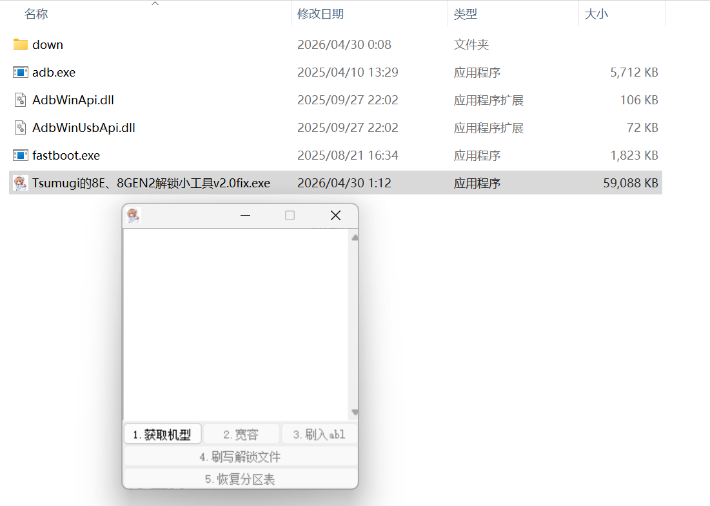
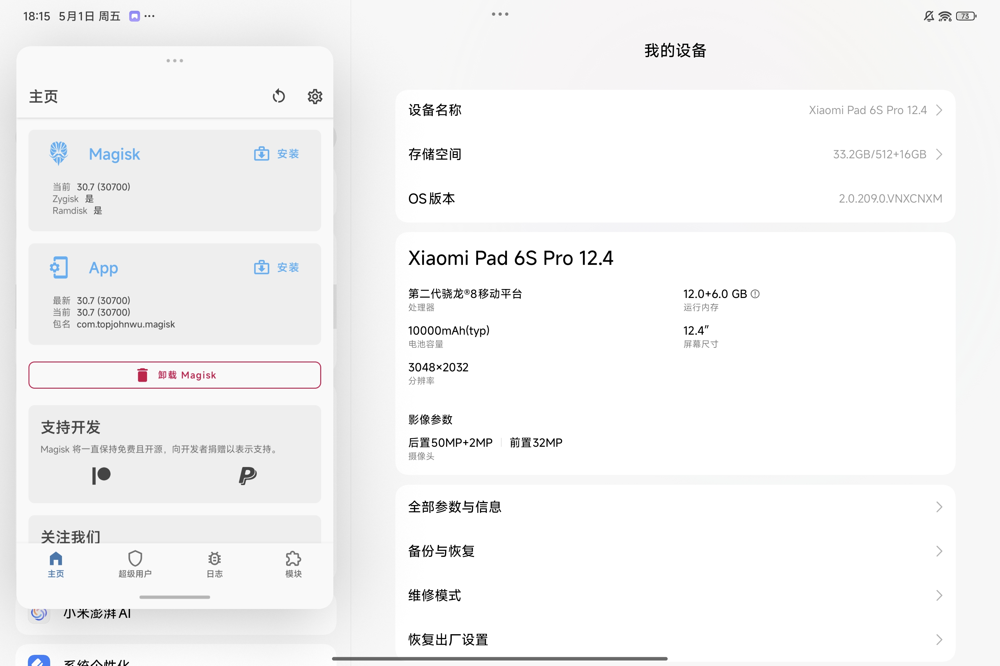

## 警告

解Bootloader属于高风险操作，以下教程请仔细阅读后再进行操作，如果因你误操作出现的黑砖红字均和本人无关，若使用其他来源资料导致变砖请自行承担后果！！

## 解锁过程

本文只记录我自己的实测过程，不代表该工具对所有版本、所有批次、所有机型都可用。

从酷安的[这条帖子](https://www.coolapk.com/feed/71485835?s=MjgzZDU3OTcxZWFjYjIyZzY5ZjJhMDUwega1620&shareUid=27135629&shareFrom=com.coolapk.app_15.2.1)得知，Xiaomi Pad 6S Pro 12.4 目前已经支持解锁 Bootloader。

我的设备信息如下：

机型：Xiaomi Pad 6S Pro 12.4
代号：sheng
处理器：Snapdragon 8 Gen 2
系统版本：HyperOS 2.0.209.0.VNXCNXM
Android 版本：Android 15

感谢[细文德斯](https://www.coolapk.com/u/39609724)提供的解锁工具，工具详情可参考其[原贴](https://www.coolapk.com/feed/71485835?s=OTBiMmUzZGRiY2M1ZWc2OWY0ZDQ2NHoa1620)。

* **工具下载地址**：[点击下载](https://www.123912.com/s/QeUAjv-il3gh)



### 操作步骤


1. 下载工具后，直接按照软件界面提示的 **第1步至第5步** 依次点击执行。
2. **注意事项**：在点击“宽容”之后，屏幕会完全黑屏，但是此时电脑端的 USB 仍保持连接状态。**这是正常现象，不要拔线，也不要乱按任何按键！**
3. 继续依次点击第三至第五步。在此期间平板任然是黑屏且没有任何显示。
4. 点完第五步后，平板依然处于黑屏状态，正常现象。
5. 前往 [ROM下载站](https://rom.wugov.com/) 下载与你当前系统版本完全一致的官方线刷包。
6. 解压线刷包，运行 `flash_all.bat` 开始刷入系统。
7. 等待刷入完成并自动开机，此时你会看到屏幕上方出现经典开启小锁。



恭喜你，解锁 Bootloader 速通成功！后续的 Root 等基础操作没必要写了~ (杂鱼~不会连Root都不会吧？)

## 漏洞解析


这次所谓“51 解锁节”并不是单个漏洞，而是一条多阶段漏洞链。更准确地说，它至少涉及以下几个环节：

1. Qualcomm ABL 中部分 fastboot OEM 命令存在输入校验问题；
2. 这些命令可能把额外参数带入启动参数，也就是 kernel cmdline；
3. 设备启动时，Android init 可能接收到被污染的启动参数；
4. SELinux 被切换到 Permissive 后，原本会被策略拦截的高权限访问路径被放宽；
5. 小米系统里的高权限服务、厂商组件或启动链状态被进一步利用；
6. 最终 Bootloader 解锁状态被修改，设备重新启动后显示小锁已解。

因此，不能简单理解成“SELinux 宽容后直接 root，然后 dd 写分区改解锁状态”。这种说法过于简化，也不够准确。

### 1. Qualcomm ABL Cmdline Injection 是什么

ABL，全称 Android Boot Loader，是高通平台启动链中的关键阶段之一。它位于更早期的固件阶段之后、Android 内核启动之前，负责处理 fastboot、加载启动镜像、校验启动链状态，并向内核传递启动参数。

这次利用链的核心之一，是部分 Qualcomm ABL 中的 fastboot OEM 命令存在参数校验不严格的问题。

公开资料中涉及的命令主要包括：

```bash
fastboot oem set-gpu-preemption
fastboot oem set-hw-fence-value
```

这些命令原本只应该接收非常有限的参数，例如 `0` 或 `1`。但是在存在问题的旧版本 ABL 中，输入后面追加的内容没有被严格拒绝，导致额外字符串可能被拼接进启动参数。

示意如下：

```bash
fastboot oem set-gpu-preemption 0 androidboot.selinux=permissive
```

或者：

```bash
fastboot oem set-hw-fence-value 0 androidboot.selinux=permissive
```

这里需要注意，网上有些说法会把命令写成：

```bash
fastboot oem set-gpu-preemption-value
```

这个写法并不严谨。公开修复和社区复盘里更常见的是 `set-gpu-preemption`，不是 `set-gpu-preemption-value`。

### 2. “宽容”按钮的作用

工具里的“宽容”，从现象和公开资料看，核心目标是让设备在下一次启动时进入 SELinux Permissive 状态。

Android 的 SELinux 是强制访问控制机制。它并不只限制普通应用，也会限制 root 进程、系统服务、厂商服务可以访问哪些文件、设备节点、分区和 Binder 接口。

正常生产设备应该运行在：

```text
SELinux Enforcing
```

也就是强制模式。

如果通过启动参数让系统进入：

```text
SELinux Permissive
```

那么 SELinux 策略违规行为通常只会被记录，而不会真正阻断。

这就是“宽容”按钮的意义：  
它不是直接给你 root，也不是直接解锁 Bootloader，而是先把系统带入一个更容易继续利用的状态。

更准确地说：

```text
ABL 参数注入
        ↓
kernel cmdline 被污染
        ↓
Android init 接收到 androidboot.selinux=permissive
        ↓
SELinux 从 Enforcing 变成 Permissive
        ↓
后续高权限调用或分区操作不再被 SELinux 强制阻断
```

### 3. SELinux Permissive 不等于 root

这里必须单独说明：**SELinux Permissive 不等于自动获得 root。**

SELinux 是访问控制层。它的作用是限制进程能做什么。  
Permissive 只是让这层限制从“强制拦截”变成“记录但放行”。

也就是说：

```text
SELinux Permissive ≠ root
SELinux Permissive ≠ 任意写分区
SELinux Permissive ≠ 直接解锁 Bootloader
```

真正的后续操作，还需要依赖设备上已经存在的高权限服务、厂商接口、系统组件或者其他漏洞。

因此，可以理解成：

```text
先通过 ABL cmdline injection 降低 SELinux 约束
再借助系统侧高权限组件完成后续操作
最后影响 Bootloader 解锁状态
```

### 4. 为什么小米设备还需要系统侧高权限组件？

仅有 Qualcomm ABL Cmdline Injection 通常还不够。

原因很简单：

即使 SELinux 进入 Permissive，普通应用或普通 shell 也不一定天然拥有写关键分区、调用厂商接口、修改启动链状态的权限。

这类工具后续通常还需要借助系统里已经存在的高权限组件，例如厂商服务、诊断服务、系统 Binder 服务或其他可被调用的特权路径。

在 SELinux Enforcing 状态下，这些路径可能会被策略阻断。

而进入 Permissive 后，原本会被拒绝的访问就可能被放行，从而让后续步骤继续执行。

因此，这条链路更接近下面这样：

```text
Qualcomm ABL fastboot OEM 命令校验不足
        ↓
注入 androidboot.selinux=permissive
        ↓
Android 启动到 SELinux Permissive
        ↓
系统侧高权限服务或厂商组件可被进一步调用
        ↓
修改启动链相关状态
        ↓
Bootloader 解锁状态生效
```

这也是为什么同样是高通平台，不同品牌、不同机型、不同系统版本的可利用性会不一样。

### 5. 关于 dd 写分区的说法

网上常见说法是：

```text
进入 SELinux Permissive 后，通过 dd 写入 devinfo、RPMB、efisp 等分区，修改 is_unlocked=1。
```

这个说法不准确。


1. `dd` 只是 Linux 用户态的普通块设备读写工具；
2. 能不能写入关键分区，取决于设备节点是否暴露、进程权限是否足够、SELinux 是否阻断、分区是否被内核或固件保护；
3. RPMB 并不是普通块设备随便 `dd` 就能改的区域，它通常涉及 TEE、安全世界和硬件认证；
4. 不同 Android 版本和不同启动链实现里，Bootloader 解锁状态不一定存放在同一个位置；
5. Android 16 / GBL 相关链条里的 EFI/UEFI 逻辑，不能直接套到所有 Android 15 设备上。

准确来说：

```text
工具链在 SELinux Permissive 的条件下，借助系统侧高权限路径或启动链相关组件，修改了设备的 Bootloader 解锁状态。具体写入位置和实现方式，取决于机型、Android 版本、固件布局和工具内部实现。
```

在我还没有逆向工具本体之前，我觉得不应该把它绝对描述为某一种固定分区写入方式。

### 6. 为什么刷入完全一致的官方线刷包

执行工具步骤后，设备会黑屏，这并不一定代表失败。  

我猜测：前面的步骤已经改变了启动状态、SELinux 状态、slot 状态、AVB 状态或启动链相关环境，但当前系统已经无法正常继续启动。

这时刷入完全一致版本的官方线刷包，主要作用是恢复一套版本匹配的启动环境。

也就是说，线刷包的作用更像是：

```text
恢复 boot / vendor_boot / dtbo / vbmeta / firmware / system 等版本一致性
```

所以，刷机时一定要选择与当前设备完全一致的官方线刷包。

特别注意：

```text
机型必须一致
区域必须一致，不要自作聪明刷国际版
Android 大版本必须一致
HyperOS 版本必须一致
不要混刷
不要跨大版本乱刷
不要运行带 lock 的脚本(你也不想又被锁上吧)
```

### 7. 为什么不能把 Android 16 / GBL 链直接套到本文设备

最近公开讨论比较多的是 Android 16 / GBL 相关利用链。

GBL 是 Android 16 引入的 Generic Bootloader 方案。部分新设备的利用链会涉及 ABL、GBL、UEFI app、EFI 分区或启动链状态修改。

但是，本文实测的 Xiaomi Pad 6S Pro 12.4 的版本是：

```text
OS2.0.209.0.VNXCNXM
Android 15
```

而公开固件列表中，`OS3.0.7.0.WNXCNXM` 才是 Android 16 版本。


本文实测链条与 Qualcomm ABL Cmdline Injection 有关；后续是否涉及 GBL、UEFI app、特定分区写入或 ABL 降级，取决于具体 Android 版本、固件布局和工具实现。


### 8. 当前状态（2026-05-01）

截至 2026-05-01，公开资料显示，Qualcomm 已经对相关 ABL fastboot OEM 命令的输入校验问题进行修复。CodeLinaro 中也能看到针对 `set-gpu-preemption`、`set-hw-fence-value` 等命令的补丁提交，核心修复思路是限制输入只能为合法的 `0` 或 `1`，拒绝尾随参数。

对于 Xiaomi Pad 6S Pro 12.4：

```text
OS2.0.209.0.VNXCNXM：本文实测可用。
OS3.0.7.0.WNXCNXM：属于 Android 16、且发布时间晚于公开修复时间线，应默认视为旧方法不可用或已被修复。本文未在该版本实测，不建议按本文流程尝试。
```

### 9. 总结

这次 Xiaomi Pad 6S Pro 12.4 的 Bootloader 解锁，本质上不是常规官方解锁，而是利用了一条多阶段漏洞链。

可以概括为：

```text
Qualcomm ABL fastboot OEM 命令参数校验不足
        ↓
kernel cmdline 注入
        ↓
androidboot.selinux=permissive 生效
        ↓
SELinux 进入 Permissive
        ↓
系统侧高权限路径被进一步利用
        ↓
Bootloader 解锁状态被修改
        ↓
刷入一致版本官方线刷包恢复可启动环境
        ↓
重启后小锁出现，解锁完成
```

所以：

```text
SELinux Permissive 只是降低访问控制限制，不等于 root；
dd 写分区不是所有设备都成立的统一解释；
RPMB 不能简单理解成普通块设备随便写；
Android 16 / GBL 链不能直接套到 Android 15 设备；
不同机型、不同补丁、不同 ABL 分支的结果可能完全不同。
```

本文只记录 `Xiaomi Pad 6S Pro 12.4 / OS2.0.209.0.VNXCNXM` 的实测过程和公开资料层面的漏洞链分析，不保证其他版本可复现。

## 参考资料

- 酷安原帖：<https://www.coolapk.com/feed/71485835?s=MjgzZDU3OTcxZWFjYjIyZzY5ZjJhMDUwega1620&shareUid=27135629&shareFrom=com.coolapk.app_15.2.1>
- 工具作者主页：<https://www.coolapk.com/u/39609724>
- Android SELinux 官方文档：<https://source.android.com/docs/security/features/selinux>
- CodeLinaro ABL 修复提交：<https://git.codelinaro.org/clo/la/abl/tianocore/edk2/-/commit/fb8e864254cdc370670233e3cb73a2b18ff33c9f>
- Android Authority：Qualcomm ABL / GBL exploit 相关报道：<https://www.androidauthority.com/qualcomm-snapdragon-8-elite-gbl-exploit-bootloader-unlock-3648651/>
- Android Authority：Qualcomm 修复声明相关报道：<https://www.androidauthority.com/qualcomm-gbl-exploit-fix-statement-3649176/>
- Xiaomi Pad 6S Pro 12.4 官方规格页：<https://www.mi.com/global/support/faq/details/KA-118747/>
- Xiaomi Pad 6S Pro 12.4 固件列表：<https://mifirm.net/model/sheng.ttt>