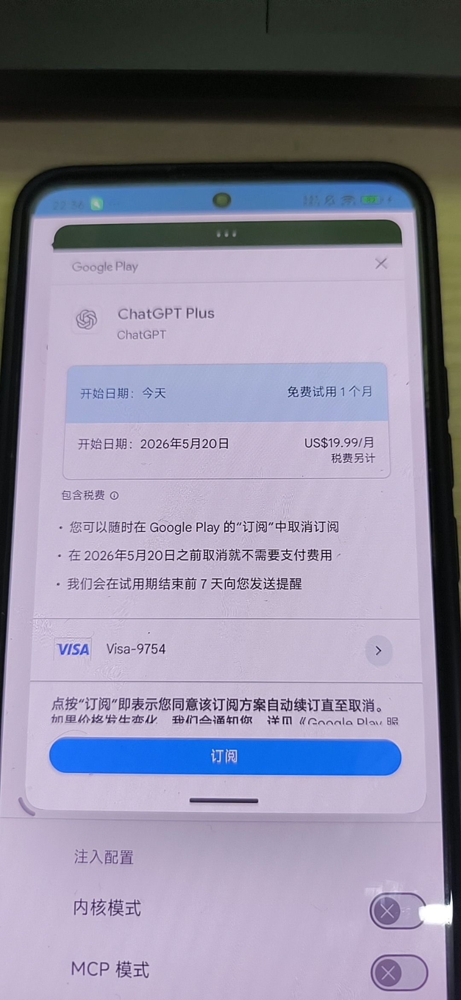

本文将记录如何通过在安卓端使用 JSHook 配合 Frida 注入，获取一个月的 ChatGPT Plus 免费试用。
此方法适用于所有GPT订阅，包括pro20x，pro10x，go，plus等等，年付月付均可。

## 准备工作

1. **设备要求**：一台已 Root 的安卓手机。
2. **账号要求**：一个已登录 Google Play 商店，并已绑定支付方式（绑卡）的谷歌账号。
3. **软件要求**：下载并安装 **JSHook** App。
   - 官网链接：[https://jshook.org/](https://jshook.org/)
   - APK 直链下载：[jshook-v1.3.1.apk](https://github.com/JsHookApp/Download/releases/download/files/jshook-v1.3.1.apk)

## 操作步骤

1. **安装并授权**：安装 JSHook 后打开，首先授予其 Root 权限。
2. **安装注入框架**：在“框架管理”界面，找到 `FridaInject` 并点击安装（我选择的是 `17.9.0` 版本）。
3. **导入脚本**：返回首页，点击“脚本管理”，将本文下方的 Hook 脚本导入其中。
4. **配置 Hook 规则**：
   - 返回首页，点击“**使用 Root 权限激活**”。
   - 转到应用选项，在列表中找到并选择 **ChatGPT** App。
   - 勾选 **启用 Hook 服务**。
   - 向下拉，找到“注入框架”，选择刚才安装的 `FridaInject 17.9.0`。
   - “注入架构”选择 **自动检测**。
   - “启用脚本”勾选你刚才导入的脚本。
5. **执行注入**：
   - 配置完成后，打开 ChatGPT App 并进入订阅界面。
   - 切换回 JSHook，点击 **开始注入**。
   - 等待注入完成（大约需要 3 秒左右，建议开启注入日志，以便随时查看是否注入成功）。
6. **完成订阅**：
   - 注入成功以后，切回 ChatGPT，点击升级订阅。
   - 在弹出的 Google Play 支付窗口中点击确认，即可完成订阅。



## Hook 脚本代码

以下是用于注入的 JavaScript 脚本：

```javascript

"use strict";
var OFFER_TOKEN = "ATCTYGUcx/4WvKJhyWqP44PKT+OR3BE5bx9loRE13nkb9gEac4+LBPrHs3dxGcmDZcLcDeYwl5pqFF1Mx7eVuJScrMow2C0BVyn/2XKDBMiiZW/rGQ4wp6ZhAK5eRLlv2dpoCIbIwqDtfyZoK6E="; // plus-1-month-free-trial收据

function log(msg) {
    console.log("[1M] " + msg);
}

Java.perform(function () {
    log("注入 plus-1-month-free-trial");
    try {
        var VMRunner = Java.use("com.pairip.VMRunner");
        VMRunner.invoke.implementation = function () {
            return null;
        };
        var VMRunner1 = Java.use("com.pairip.VMRunner$1");
        VMRunner1.run.implementation = function () { };
        log("成功屏蔽 VMRunner");
    } catch (e) {
        log("屏蔽 VMRunner 失败或类不存在: " + e.message);
    }

    try {
        var TM = Java.use("com.android.org.conscrypt.TrustManagerImpl");
        TM.checkTrustedRecursive.overload(
            "[Ljava.security.cert.X509Certificate;",
            "java.net.Socket",
            "boolean",
            "boolean",
            "boolean",
            "java.util.Collection",
            "java.util.Collection"
        ).implementation = function () {
            log("触发 TrustManagerImpl 绕过");
            return Java.use("java.util.ArrayList").$new();
        };
        log("成功 Hook TrustManagerImpl");
    } catch (e) {
        log("Hook TrustManagerImpl 失败: " + e.message);
    }

    var JStr = Java.use("java.lang.String");

    try {
        var Bundle = Java.use("android.os.Bundle");
        Bundle.putStringArrayList.overload("java.lang.String", "java.util.ArrayList").implementation = function (key, value) {
            if ((key === "SKU_OFFER_ID_TOKEN_LIST" || key === "OFFER_ID_TOKEN_LIST") && value != null) {
                var newList = Java.use("java.util.ArrayList").$new();
                for (var i = 0; i < value.size(); i++) {
                    newList.add(JStr.$new(OFFER_TOKEN));
                }
                log("offerToken 已注入 Bundle (" + key + ")");
                return this.putStringArrayList(key, newList);
            }
            return this.putStringArrayList(key, value);
        };
        log("成功 Hook Bundle.putStringArrayList");
    } catch (e) {
        log("Hook Bundle 失败: " + e.message);
    }

    try {
        var JSONObj = Java.use("org.json.JSONObject");
        JSONObj.$init.overload("java.lang.String").implementation = function (s) {
            if (s !== null && s.indexOf("oai.chatgpt.plus") !== -1 && s.indexOf("offerToken") !== -1) {
                var patched = s.replace(
                    /"offerToken"\s*:\s*"[^"]+"/g,
                    '"offerToken":"' + OFFER_TOKEN + '"'
                );
                log("offerToken 已成功替换入 JSON");
                return this.$init(patched);
            }
            return this.$init(s);
        };
        log("成功 Hook JSONObject 构造函数");
    } catch (e) {
        log("Hook JSON 失败: " + e.message);
    }

    log("所有 Hook 就绪。请在 App 中点击订阅按钮触发逻辑。");
}); 
```

补充说明：
脚本的原文出处在 https://www.azx.us/posts/700 。原作者仅适配了 x86 架构的安卓模拟器，本博客中的代码为经过二次修改的版本，去除了没必要的反检测，已完美支持 arm64 架构设备。